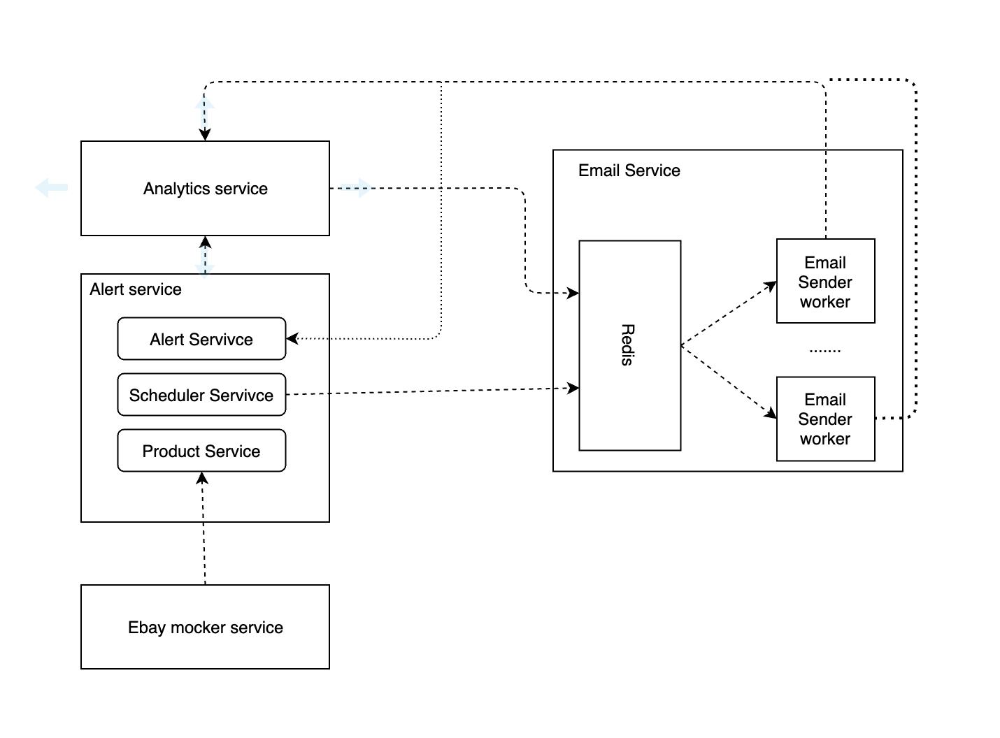

# Ebay Alert System 

An alert system which allows users to create/update alerts based on search keyword.
The alerts are mailed to the user at regular intervals configured by the user.
Historical price analysis reports are also sent to the users via email every day.

# Prerequisites

### Install Docker
Refer to https://docs.docker.com/get-docker/ to install docker

# Cloning and Running the Application in local

* Clone the project into local
    ```bash
    git clone https://github.com/Rudrarka/Alert-System.git
    ```

* Run the following commands to build and run the application:
    ```bash
    cd Alert-System
    docker-compose up -d --build
    ```


Alert service Runs on **localhost:5000**

Swagger : **localhost:5000/swagger**

# High Level Design and Docker Compose Components



The alert service comprises of the alert, scheduler and the product service (for simplicity). It is used to create/update/delete/get alerts to/from the postgres database. 

When an alert is created, the rest api to the ebay mocker(json server) is hit to get the products based on the keyword and stored in the database. Also the scheduler is set to run with the interval as the input time by the user and add job in the queue to send email.
The scheduler job queries the database and creates the email details json and adds in the queue. This could be a seperate service (Scheduler service) for better performance. 

A celery worker picks the jobs from and sends the email. A serverless function can also be used for this.  

Mailhog is used as the smtp server. All the mails can be seen in the mailhog inbox.

A node json-server is used to mock the ebay apis(Only get endpoint is used for this  by the alert service). A wrapper service Ebay mocker service is used to emit socketio event in case of product update/create/delete.

An event listener in the alert service is polling for these events. It would update the database when it gets any events. Intention is when a product is deleted, its deleted from the database and when its added, all the alert keywords are searched again to update the database.
This can again be done using a serverless function as it could be a long running async process.

**Note: Create and delete is not handled yet.**

Analytics service is used to store the aggregated data from all other components and perform analysis on them. 
In our case, it takes relevant data from the alert service database and stores in the analytics database. I am using postgres db for simplicity for this purpose. 

**Time series databases like influx db etc can also be used for this purpose as these are optimised for time series data.** 

The analytics service comprises of a Flask App which runs a scheduler job everyday at a time to transfer data from alert service to analytics service. Historical data can be found here in the analytics service. 
Another scheduled job is run everyday to check for price changes and add to the queue of the mailing service.

**Currently, the history of product prices is maintained. This can be done for alerts as well.**

**The analytics service can be made serverless and the ETL and Email scheduler jobs can be performed by serverless functions.**

## Docker compose components

* **Alert service:** 
   
    A flask application which creates/deletes/updates and lists the alerts created.
    A scheduler is running to schedule jobs to send email to users. 
    It also polls the ebay-event-mocker service for any update/create/delete of any product.
    
    Server runs on **http://localhost:5000**
    
    Swagger can be accessed on **http://localhost:5000/swagger**

* **Alert db:** 
    
    A postgres db which stores the alert, users and products data.

* **Redis:**

    A redis server used as a message broker for the email service.

* **Email sender worker:**

    Celery workers used for the job of sending email.

* **json-server:**

    Application used for mocking ebay apis(get products and search products). Mock data is used a products.

* **ebay-event-mocker-service:**

    A flask application to mock ebay's event emitter which acts as a wrapper api of the json server. It emits an event when a product is updated.
    
    Server runs on **http://localhost:5001**
    
* **mailhog:** 

    SMPT server used for local development of email service.
    Mailhog provides a inbox where the emails can be seen.
    Mailhog mailbox can be accessed on **http://localhost:8025**

* **analytics-db:** 

    A postgres database used for analytics purpose. Data from all components are collected here to perform analytics.

* **analytics-service:** 

    A Flask application acting as the scheduler to schedule data transfer job and email scheduler job.

# Current Issues

Following features are not working properly/work in progress:

* Error in event listener connection due to which price change events are not listened and nhence not reflected in the database.

* Both emails jobs(alert and analytics emails) are sent to the same queue. Both can be sent to different queues for better performance.

* Calculation of decrease/increase in historical price is in progress. Mail sending is checked using dummy data.


